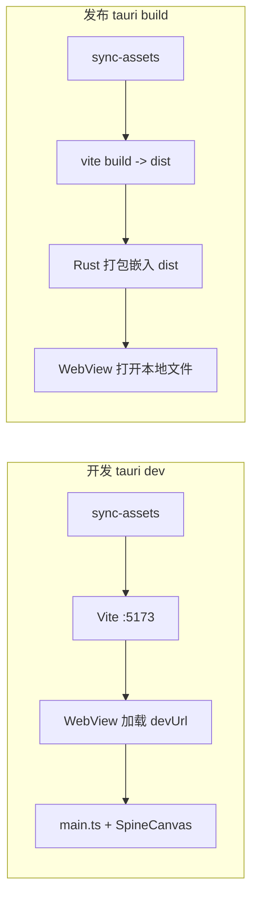
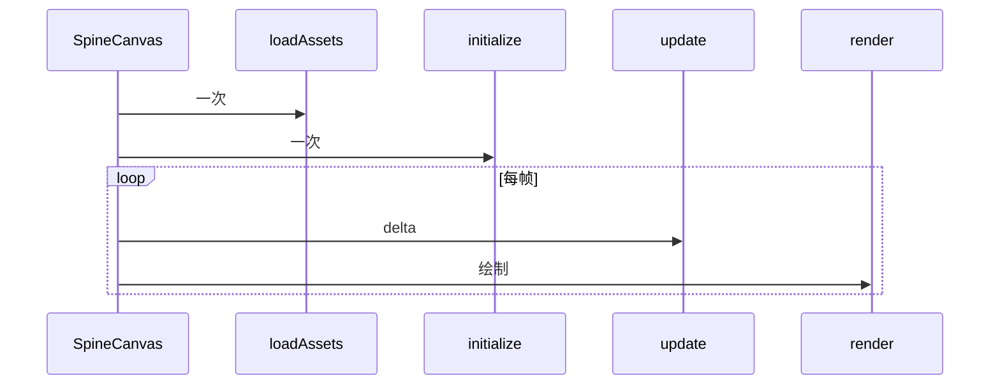

# pet-web / Tauri 端导读（给略懂 JS 的前端初学者）

本文只讲 **`pet-web/` 子项目**：桌面壳（Tauri）+ 网页技术（Vite + TypeScript）+ **Spine 官方 WebGL 运行时**。  
**不讲** 仓库根目录的 **Python**（`src/star_rail_pet/`、`tools/preview_spine_character.py` 等）。两边共用 **`assets/argenti`** 资源，但**代码与运行时完全独立**。

> **当前仓库重心**：**桌宠与功能开发以本文所述 Tauri 线为准**。**Python 线已搁置维护**（不接新功能），仅作可选预览与对照；详见根目录 [`README.md`](../README.md)。

---

## 1. 先分清：Python 线 vs Tauri 线

| 维度 | Python 线（根目录） | Tauri 线（`pet-web/`） |
|------|---------------------|-------------------------|
| 入口 | `python tools/preview_spine_character.py` | `cd pet-web` → `npm run tauri:dev` |
| 语言 | Python + Pygame/OpenGL | TypeScript + **官方** Spine JS + WebGL |
| Spine 实现 | 自研精简读取/网格绘制 | `@esotericsoftware/spine-core` + `spine-webgl` |
| 能力 | 文档已写明：未实现 slot/IK/变形等大量特性 | 接近编辑器导出语义，适合流汗、说话、mesh 形变等 |
| 资源 | 直接读 `assets/argenti` | 构建前复制到 `public/argenti`，浏览器/WebView 用 URL 加载 |

记住：**想「和 Spine 编辑器里一样完整」、做桌宠功能 → 以 Tauri 这条为主**；想理解自研 mesh 管线（搁置中）→ 可看 [`Python导读.md`](Python导读.md)。

---

## 2. Tauri 一句话是什么？

可以把 **Tauri** 理解成：**用系统里的 WebView（例如 Windows 上的 WebView2）开一个窗口，里面跑你的前端页面**；**壳层**用 **Rust** 写得很薄，负责窗口、打包、系统集成。  

本项目的 **游戏画面** 不是 Rust 画的，而是 **HTML 里的 `<canvas>` + WebGL（Spine 库）** 画的。

下面单独把 **WebView** 讲清楚，方便你只写过 RN 里「嵌 WebView + 通信」、但没系统学过「WebView 到底是什么」的同学对齐概念。

---

## 3. WebView 是什么？（和 RN 里嵌网页的关系）

### 3.1 一句话

**WebView** = 在**别的应用程序窗口里**，嵌一块「**小型浏览器**」：能解析 **HTML / CSS / JavaScript**，能跑 **Canvas、WebGL**，和你在 Chrome 里打开网页用的是**同一套 Web 标准**（具体引擎因系统而异）。

可以把它想成：**没有地址栏、没有多标签、只占一块矩形区域**的浏览器视图；外面那层是**原生壳**（桌面程序、RN 页面等）。

### 3.2 和「打开 Chrome / Edge」有什么区别？

- 用户**不必**先打开独立浏览器窗口；**壳程序自己创建 WebView**，把网页画在窗口的某一块（Tauri 里通常是**整窗都是 WebView**）。
- 页面里的 JS、DOM、Canvas，都跑在 **WebView 提供的 JavaScript 环境**里，和壳语言（Rust、Kotlin、Objective‑C 等）**不是同一个进程/运行时**，需要 **桥（bridge）或 IPC** 才能互相传数据——你在 **React Native 里 `WebView` 和原生通信**（`postMessage`、注入 JS、`onMessage`）就是在干这件事。
- **Tauri** 里则是 **Rust 壳 ↔ 前端页面** 通过 Tauri 提供的 **IPC / 命令** 通信；**本仓库几乎还没写这类调用**，所以你现在看到的几乎全是 **WebView 里纯 TS 在跑**。

### 3.3 系统上一般用什么引擎？（以 Windows 为例）

- **Windows**：常用 **WebView2**，底层与 **Edge（Chromium 系）** 同源，支持现代 JS、WebGL。
- **macOS**：`WKWebView`（Safari 系）。
- **Linux**：常见 WebKitGTK 等。

所以：**不是**「Tauri 自带一个迷你 Chrome 安装包」那种模式（那是 **Electron** 的思路）；**Tauri 更倾向复用系统已提供的 WebView**，安装包体积通常更小，但要求系统有可用的 WebView 组件（Win10/11 一般已带 WebView2 运行时）。

### 3.4 对照你熟悉的 RN + WebView

| 概念 | React Native 里 | Tauri 桌面里（本仓库） |
|------|-----------------|-------------------------|
| 谁在「包」着网页 | RN 原生视图 | Rust + Tauri 创建的窗口 |
| 网页跑在哪 | `WebView` 组件内 | 整个窗口的 WebView2 |
| 柱状图 / Canvas | H5 里用 ECharts、Canvas 画 | `main.ts` 里 Spine 用 **WebGL** 画在 `<canvas>` 上，原理类似：都是 **Web 技术栈** |
| 和原生通信 | `postMessage`、桥接 API | Tauri 的 `invoke` 等（本项目未展开） |
| 调试 | Safari/Chrome 远程调试等 | 可开 **WebView 开发者工具**（依 Tauri/系统版本而定） |

你以前做过 **RN ↔ WebView 通信再画图**，本质已经接触过 **「壳 + 嵌入网页」**；**Tauri 只是把壳从 RN 换成了 Rust 桌面程序，嵌入的仍是同一类网页技术**。

### 3.5 在本项目中，数据/画面从哪走？

1. **开发时**：Vite 提供 `http://localhost:5173/...`，**WebView 像浏览器一样用 HTTP 加载**该地址。
2. **发布后**：前端打成静态文件装进应用，**WebView 用 `file` 或应用内 URL 加载本地 `dist`**，不再依赖 5173。
3. **Spine 资源**：`main.ts` 里用 **URL 路径**（如 `/argenti/1302.atlas`）去 `fetch`/解析；这些请求发生在 **WebView 的网页环境**里，**不是** Rust 直接读盘（除非以后你自己加 Tauri 命令去读文件再传给前端）。

### 3.6 小结（防和 Python 线混淆）

- **WebView** = 壳里的「**内嵌浏览器区域**」，你的 **JS/TS + Canvas/WebGL** 都在这里跑。
- **Python 线**没有 WebView：是 **Pygame 窗口 + OpenGL**，另一条路。
- 读后续章节时，凡说「前端」「页面」「`main.ts`」，在 Tauri 里都指 **WebView 里这一套**。

---

## 4. 目录地图（只列 Tauri 相关）

```
star-rail-pet/
├── assets/argenti/              # 源资源（与 Python 共用）
│
└── pet-web/                     # ★ Tauri + 前端 子项目
    ├── package.json             # npm 脚本、依赖
    ├── index.html               # 页面壳，挂 #app、引入 main.ts
    ├── tsconfig.json
    ├── src/
    │   ├── main.ts              # ★ 几乎全部前端逻辑 + Spine 初始化
    │   └── style.css            # 全屏 canvas、状态条样式
    ├── public/
    │   └── argenti/             # sync-assets 生成，勿手改源
    ├── scripts/
    │   └── sync-assets.mjs      # 从 ../../assets/argenti 复制到 public/argenti
    └── src-tauri/               # ★ Rust 壳 + Tauri 配置
        ├── Cargo.toml           # Rust 依赖（tauri 等）
        ├── tauri.conf.json      # ★ 窗口、devUrl、打包入口
        ├── src/
        │   ├── main.rs          # 程序入口，调用 lib
        │   └── lib.rs           # Tauri Builder：本仓库几乎无自定义逻辑
        └── icons/               # 安装包图标
```

**没有使用 React/Vue**：就是一个 `index.html` + **`main.ts` 单文件** 驱动，对只学过 React 的同学来说，相当于「自己操作 DOM + 跑一个游戏循环」，没有组件树。

---

## 5. 从敲命令到出画面：两条路径

### 4.1 开发：`npm run tauri:dev`

1. `npm run sync-assets` → 把 `assets/argenti` 拷到 `pet-web/public/argenti`。  
2. `tauri dev` → 读 `tauri.conf.json`：  
   - 先执行 **`beforeDevCommand`**：`npm run dev` → **Vite** 起本地 **`http://localhost:5173`**。  
   - 再开 **WebView 窗口**，加载 **`devUrl`** 指向的该地址。  
3. 浏览器访问的页面里执行 `main.ts`：`SpineCanvas` 用 **`pathPrefix: "/argenti/"`** 去拉 `1302.atlas`、`1302.1a88ff13.json` 和贴图（Vite 对 `public/` 根路径直出）。

### 4.2 发布构建：`npm run tauri:build`

1. `beforeBuildCommand`：`npm run build` → Vite 产出静态文件到 **`pet-web/dist/`**。  
2. Tauri 把 **`frontendDist`**（`../dist`）打进安装包；运行时 **WebView 打开本地打包好的前端**，不再依赖 5173 端口。



---

## 6. `package.json` 脚本在干什么？

| 脚本 | 作用 |
|------|------|
| `sync-assets` | Node 执行 `scripts/sync-assets.mjs`，同步资源 |
| `dev` | 同步后 **`vite`**，纯浏览器调试（无桌面壳） |
| `build` | 同步后 `tsc` + `vite build` → `dist/` |
| `tauri:dev` | 同步 + **`tauri dev`**（Vite + 窗口） |
| `tauri:build` | 同步 + **`tauri build`**（安装包） |

---

## 7. `sync-assets.mjs`（资源从哪来）

- **`__dirname`**：`pet-web/scripts/`。  
- **`repoRoot`**：向上两级 → 仓库根 `star-rail-pet/`。  
- **`src`**：`assets/argenti`。  
- **`dest`**：`pet-web/public/argenti`。  

用 `cpSync` **整目录递归复制**。这样 **Tauri/Web 只认 `pet-web` 下面的 `public`**，不必在运行时去读仓库根路径（浏览器安全模型也不允许随意读盘）。

---

## 8. `tauri.conf.json`（和前端如何接上）

| 字段 | 含义 |
|------|------|
| `build.devUrl` | 开发时 WebView 打开的 URL（Vite 默认 5173） |
| `build.beforeDevCommand` | 启动前先跑 `npm run dev` 起 Vite |
| `build.beforeBuildCommand` | 打包前执行 `npm run build` |
| `build.frontendDist` | 发布时前端静态资源目录（`dist`） |
| `app.windows[]` | 窗口标题、大小、是否可缩放等 |
| `app.security.csp` | 内容安全策略；此处为 `null` 便于本地开发加载资源 |
| `bundle` | 安装包格式（msi/nsis）、图标路径 |

**本仓库没有配置「前端调用 Rust 命令」的自定义 IPC**（没有复杂 `invoke` 场景），Rust 侧几乎是模板应用。

---

## 9. Rust 壳：`main.rs` 与 `lib.rs`

- **`main.rs`**：程序入口，调用 `app_lib::run()`；`windows_subsystem` 避免发布版多弹控制台。  
- **`lib.rs`**：`tauri::Builder::default()`，调试模式下挂 **`tauri-plugin-log`**，然后 **`run(generate_context!())`**。  

**没有**在本项目中写「Rust 里画 Spine」「Rust 里读 JSON」——那些全在 **前端 `main.ts`**。

---

## 10. 前端核心：`src/main.ts` 架构

### 10.1 依赖分工

- **`@esotericsoftware/spine-core`**：骨骼数据、动画状态、JSON 解析、`Skeleton`、`AnimationState`、`Physics` 等。  
- **`@esotericsoftware/spine-webgl`**：`SpineCanvas`（游戏循环 + 资源加载 + WebGL 渲染封装）、`ResizeMode` 等。

### 10.2 页面结构（非 React）

1. `index.html` 里只有 `<div id="app"></div>`。  
2. `main.ts` 里 `querySelector("#app")`，**`innerHTML`** 写入 `<canvas id="skeleton">` 和状态 `<p id="status">`。  
3. 设置 `canvas.width/height` 为窗口尺寸；`resize` 时再改。

这就是「命令式 DOM」，和 React 的声明式 UI 不同，但更小、适合单页 canvas 应用。

### 10.3 `SpineCanvas` 是什么？

可以把它想成 **一个小型游戏引擎的壳**：

- 内部有 **`requestAnimationFrame` 循环**（或等价机制）。  
- 按顺序调用你传入的 **`app`** 对象上的几个**生命周期钩子**。

你**不需要**自己写 `requestAnimationFrame`，只实现这些钩子即可。

---

## 11. 生命周期钩子：调用顺序与职责

下面按**真实执行顺序**说明（成功加载时）。

| 阶段 | 钩子 | 何时调用 | 本项目中做什么 |
|------|------|----------|----------------|
| 1 | `loadAssets(sp)` | 一开始，用于排队加载 | `loadTextureAtlas("1302.atlas")`、`loadJson("1302.1a88ff13.json")` |
| 2 | `initialize(sp)` | 全部资源加载成功后 **一次** | 解析骨骼、创建 `Skeleton` / `AnimationState`、设动画、setup pose、**捕获稳定相机**、`fitCamera`、更新 `#status` |
| 3 | `update(sp, delta)` | **每一帧**，在 `render` 前 | `animState.update(delta)` → `apply` 到骨骼 → `skeleton.updateWorldTransform(Physics.update)` |
| 4 | `render(sp)` | **每一帧** | 清屏、`resize`、`fitCamera`（只更新视口与 zoom，中心用稳定值）、`begin` → `drawSkeleton` → `end` |
| 5 | `error(sp, errors)` | 加载失败 | 把错误写到 `#status` |



---

## 12. `main.ts` 函数与变量（按阅读顺序）

### 12.1 常量

- **`SKEL` / `ATLAS`**：Spine JSON 与 atlas 文件名（放在 `public/argenti/`，URL 为 `/argenti/xxx`）。

### 12.2 `animFromQuery()`

- 读浏览器地址 **`?anim=`**，没有则默认 **`"idel"`**。  
- **纯前端**：换动画需带参打开，例如 `http://localhost:5173/?anim=emoji_2`。

### 12.3 相机稳定变量 `stableMidX/Y`、`stableBoundsW/H`

- 在 **`initialize`** 里 **`captureStableCameraFromSkeleton()`** 从 **setup pose** 的 `getBoundsRect()` 取一次。  
- **目的**：避免每帧用当前包围盒中心跟拍，否则呼吸时 AABB 微变会导致画面轻微左右漂移（Python 版是正交投影固定，行为对齐）。

### 12.4 `captureStableCameraFromSkeleton()`

- 从当前 `skeleton` 读包围盒，写入四个 stable 变量。

### 12.5 `fitCamera(sp)`

- 设置 **视口** 为 canvas 像素尺寸。  
- **相机位置**固定为 `stableMidX/Y`。  
- **zoom** 用 stable 宽高 × `pad(1.12)` 与 canvas 宽高比算出，保证角色在窗内。  
- 窗口大小变化时仍调用，只改 zoom/视口，**不改世界中心**。

### 12.6 `initialize(sp)` 逻辑摘要

1. `require` 拿到 atlas 与 JSON。  
2. **`SkeletonJson` + `AtlasAttachmentLoader`** → `readSkeletonData` → **`Skeleton` 数据**。  
3. **`AnimationStateData` + `AnimationState`**。  
4. 若找不到动画名 → 提示可用列表并 **return**（不再渲染骨骼）。  
5. **`setAnimation(0, animName, true)`** 第一条轨道循环播放。  
6. **`setToSetupPose()`** 再 **`updateWorldTransform(Physics.update)`**。  
7. **捕获稳定相机** → **`fitCamera`**。  

### 12.7 `update` / `render`

- **update**：推进动画时间并写回骨骼世界矩阵。  
- **render**：`clear` 背景色 → **`premultipliedAlpha: false`** 的 `drawSkeleton`（与 atlas 非 PMA 导出一致，避免发白边）。  

### 12.8 `window.resize`

- 只更新 **canvas 的 width/height**；下一帧 `fitCamera` 会跟上。

---

## 13. 和 Python 端容易混淆的点

| 误区 | 说明 |
|------|------|
| 「Tauri 里跑 Python」 | **不跑**。Tauri 里是 **WebView + JS/TS**。 |
| 「改 `star_rail_pet` 会影响桌面宠物」 | **不会**，除非你再写桥接；当前 **互不影响**。 |
| 「`idel` 拼写」 | 资源里动画名就是 **`idel`**（非 `idle`），两边参数需与 JSON 一致。 |
| 「资源改完为何不生效」 | Web 线要 **`npm run sync-assets`** 或跑带 sync 的脚本；Python 直接读 `assets/argenti`。 |

---

## 14. 以后想扩展功能，通常改哪里？

| 需求 | 建议位置 |
|------|----------|
| 换默认动画、多轨混合、队列播放 | `main.ts` → `AnimationState` API（仍用 spine-core） |
| 键盘/鼠标交互 | `SpineCanvas` 提供 `sp.input`；或在 `canvas` 上挂 DOM 事件 |
| 与系统深度集成（托盘、全局快捷键） | `src-tauri` Rust + Tauri 插件 / `invoke` |
| 换角色资源 | 换 `SKEL`/`ATLAS` 常量 + 同步后的 `public/argenti` |
| UI 面板（设置、选动画） | 可在 `#app` 里加 HTML 或用任意框架；当前仓库为保持简单未引入 React |

---

## 15. 小结

- **Tauri** 在本项目 = **薄 Rust 窗口 + WebView 里跑 Vite 构建的前端**。  
- **WebView** = 壳里嵌的「小浏览器」，`main.ts` / Canvas / WebGL 都跑在里边；和 RN 里嵌 `WebView` 是同一类模型，只是壳从移动端换成了桌面 Rust（见 **第 3 节**）。  
- **所有 Spine 显示逻辑**在 **`pet-web/src/main.ts`**，通过 **`SpineCanvas` 四个钩子** 组织加载、初始化、每帧更新与绘制。  
- **Python 线**是另一条技术栈，共用 **`assets/argenti`**，但**不要**和 `pet-web` 的代码混在同一套「调用链」里理解。

读完本文后，若要深入 Tauri 通用概念，可再读 [Tauri 官方文档](https://tauri.app/)；若要深入 Spine，以 [Esoteric Spine Runtimes](https://esotericsoftware.com/spine-runtimes) 为准。
