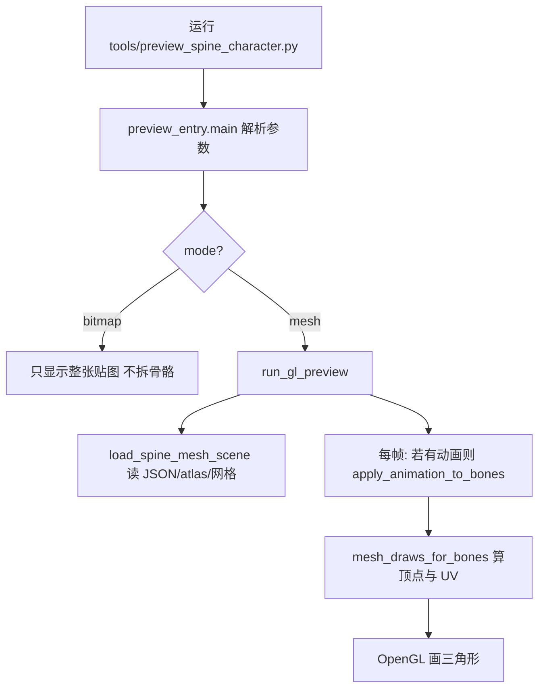

# 银枝桌宠项目 — 新手导读

面向：**会一点 Python 基础**（变量、函数、`import`），但**没用过 Spine**、也想搞懂「这个仓库在干什么」的读者。  
本文用日常语言说明**思路**；具体参数仍以代码为准。

---

## 1. 这个项目到底在做什么？

把游戏角色用的 **Spine 导出数据**（一个 JSON + 一张图集说明 + 一张大图）读进程序，用 **Python** 算出每一根「骨头」在屏幕上的位置，再按 **OpenGL** 把贴图切成很多小三角形画出来，在窗口里看到**会动的 Q 版小人**（若指定了 `--anim`）。

可以把它理解成：**我们写了一个很小、不完整的「Spine 播放器」**，只够预览和以后做桌宠，不是官方那个功能齐全的 Spine 运行时。

---

## 2. 先搞懂三个词：Spine、骨骼、网格

你不用先学 Spine 软件，只要知道游戏里常见的 2D 角色往往这样组织：

| 概念 | 白话 |
|------|------|
| **骨骼（Bone）** | 像皮影戏的木棍：身体、胳膊、头各自有一根「骨」，父子连在一起。动父骨，子骨跟着动。 |
| **网格（Mesh）** | 把一块图（比如脸）切成很多三角形顶点；每个顶点可以**加权**到多根骨上，这样转头时脸会自然变形。 |
| **图集（Atlas）** | 很多小图拼成一张大图 `1302.png`，`.atlas` 文件记录每个小图在大图上的位置和名字。 |

**Spine** 是制作这种角色的商业工具；别人已经用 Spine 做好角色并**导出**成 JSON。我们的程序**不打开 Spine**，只**读导出文件**。

---

## 3. 资源文件夹里常见文件（以 `assets/argenti/` 为例）

| 文件 | 作用 |
|------|------|
| `1302.1a88ff13.json` | **Spine 骨骼 JSON**（必须是非 `_ske` 的那份）：骨骼列表、默认姿势、皮肤、网格顶点、动画数据等。程序主要读它。 |
| `1302.1a88ff13_ske.json` | 往往是 **DragonBones** 格式，本项目的**贴图管线不用它**；`preview_skeleton.py` 线框预览才会碰。 |
| `1302.atlas` | 文本：大图尺寸、每个「小图块」在 `1302.png` 上的矩形与是否旋转。 |
| `1302.png` | 整张纹理；没有它就无法给三角形上色。 |
| `*.spine`（若有） | Spine **工程文件**，给编辑器用；**当前 Python 代码不读取**。 |

---

## 4. 程序从运行到出画面：一条时间线

### 4.1 你在终端输入什么？

常见命令：

```bash
python tools/preview_spine_character.py --anim idel
```

含义：用默认资源目录 `assets/argenti/`，播放名为 `idel` 的待机动画。

### 4.2 代码谁先跑？（调用顺序）

1. **`tools/preview_spine_character.py`**（或根目录 `preview_spine_character.py`）  
   - 把 `src` 加进 Python 的搜索路径，这样能找到包 `star_rail_pet`。

2. **`star_rail_pet.preview_entry` 里的 `main()`**  
   - 用 `argparse` 解析 `--dir`、`--anim`、`--mode` 等参数。  
   - 若选 `mesh`（默认），调用 **`run_gl_preview(...)`**。

3. **`star_rail_pet.render.gl_preview.run_gl_preview`**  
   - 初始化 pygame 窗口（带 OpenGL）。  
   - 调 **`load_spine_mesh_scene`** 一次性读入 JSON、atlas、列出要画的 mesh。  
   - 若指定了动画名，进入**循环**：每一帧根据时间算姿势 → 算三角形 → 画屏。

用流程图概括「主路径」：



---

## 5. 每一帧「算姿势 → 画图」在干什么？

可以记四步（顺序很重要）：

1. **动画采样（可选）**  
   - 模块：`star_rail_pet.anim.sample`  
   - 函数：`apply_animation_to_bones(骨骼模板, 某段动画数据, 时间 t)`  
   - 含义：根据 JSON 里记录的关键帧，**线性**插值出这一帧每根骨的旋转、位移等（**不是**完整 Spine 运行时，没有贝塞尔、没有 slot 换图等）。

2. **骨骼世界矩阵**  
   - 模块：`star_rail_pet.spine.bones`  
   - 函数：`compute_bone_worlds(...)`  
   - 含义：从根骨开始，把每根骨在父骨坐标系下的变换，**合成**成「世界坐标系」下的 2×2 矩阵 + 平移，得到 `BoneWorld`。

3. **Transform 约束（部分实现）**  
   - 模块：`star_rail_pet.spine.constraints`  
   - 函数：`apply_transform_constraints_translate_world`  
   - 含义：让脸、头发等骨按 JSON 里的 **transform 约束**去跟随目标骨（只做了**世界平移**相关的一块，缓解脸和身子不同步的感觉）。

4. **顶点变换与画图**  
   - 模块：`star_rail_pet.spine.mesh_scene`（顶点加权）、`star_rail_pet.spine.draw`（拼绘制列表）  
   - 每个 mesh 顶点在数据里记录了受哪些骨影响、权重多少；用 `BoneWorld` 乘出来得到屏幕附近的平面坐标，再配上 UV 从 `1302.png` 取样。  
   - `run_gl_preview` 里用 **固定正交投影** 把角色框进窗口。

---

## 6. 代码放在哪？建议怎么读？

### 6.1 目录与职责（和「从哪读起」）

| 路径 | 适合新手怎么读 |
|------|----------------|
| `src/star_rail_pet/preview_entry.py` | **入口**：参数、默认资源路径。第一遍通读。 |
| `src/star_rail_pet/render/gl_preview.py` | **窗口与主循环**：何时加载、何时每帧重算。第二遍。 |
| `src/star_rail_pet/spine/mesh_scene.py` | **读 JSON、建网格列表**：`load_spine_mesh_scene`。想懂数据从哪来，读这里。 |
| `src/star_rail_pet/spine/bones.py` | **数学最多**：骨骼世界矩阵。可以稍晚读，知道「输入一堆骨 JSON，输出 `BoneWorld` 列表」即可。 |
| `src/star_rail_pet/spine/constraints.py` | **约束**：在 `bones` 之后补一层修正。 |
| `src/star_rail_pet/spine/draw.py` | **把「骨 + 网格」变成三角形顶点**：`mesh_draws_for_bones`。 |
| `src/star_rail_pet/spine/atlas.py` | **图集与 UV**：小图在大图上的位置、转到 OpenGL 纹理坐标。 |
| `src/star_rail_pet/anim/sample.py` | **动画时间 → 骨骼字段**：关键字 `rotate`/`translate` 等。 |

### 6.2 函数之间「谁调用谁」（精简版）

```
main()
  └─ run_gl_preview()
        ├─ load_spine_mesh_scene()     # 启动时一次
        └─ 循环每一帧:
              pose_draws()
                ├─ apply_animation_to_bones()   # 若有 --anim
                └─ mesh_draws_for_bones()
                      ├─ compute_bone_worlds()
                      ├─ apply_transform_constraints_translate_world()
                      └─ mesh_world_vertices() + region_uv_to_gl_texcoord()
```

你在 `gl_preview.py` 里搜 `pose_draws` 或 `mesh_draws_for_bones`，就能顺着点进上面这条链。

---

## 7. 本实现**故意没做**或**做不到**的事（避免误解）

知道边界，读代码时就不会纳闷「为什么这里没有」：

- **不是**官方 Spine 运行时；**没有**完整 IK、路径约束、网格形变动画、slot 附件切换、皮肤切换等。
- 动画是**关键帧之间直线插值**，曲线（贝塞尔）被简化掉了。
- 很多 **emoji 动画**在 JSON 里主要是**换图（slot）**，我们只动骨骼，所以看起来会「不动」——这是数据与实现限制，不是你命令写错。

更偏「产品/架构」的说明见 `docs/架构规划.md`；偏「能不能做桌宠」的见 `docs/技术文档.md`。

---

## 8. 和你学的 Python 怎么对应？

- **`import`**：把别的文件里的函数「借过来用」，例如 `from star_rail_pet.render.gl_preview import run_gl_preview`。  
- **函数**：输入参数 → 返回值；例如 `load_spine_mesh_scene(目录)` 返回一长串元组（路径、骨骼列表、动画字典等）。  
- **`Path`**：表示文件夹/文件路径，比字符串拼接安全。  
- **循环 `while running`**：游戏/预览里常见的「直到用户关掉窗口」结构；里面每一圈就是**一帧**。

---

## 9. 小结：一句话记住

**读 JSON 和图集 → 算出每根骨在世界上的矩阵 → 按权重算每个顶点 → 用 OpenGL 贴图画三角形；动画只是每帧改「骨的数据」再重复算一遍。**

---

*若你之后要加「点头、跟鼠标」等，会在 `apply_animation_to_bones` 之后、`compute_bone_worlds` 之前再叠一层程序写的位移/旋转（见 `docs/架构规划.md` 中的预留说明）。*
